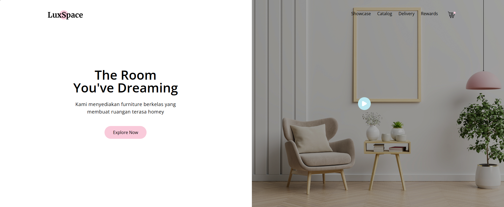

# 🛋️ LuxSpace – Furniture Online Store Mockup




LuxSpace adalah sebuah website mockup untuk toko online furniture yang dirancang dengan tampilan modern dan elegan. Proyek ini merupakan hasil eksplorasi front-end menggunakan **HTML5**, **Tailwind CSS**, dan **JavaScript** tanpa framework tambahan, untuk menunjukkan pemahaman terhadap layout responsif dan styling utility-first.


## ✨ Fitur Utama

- Landing page interaktif dan bersih
- Navigasi sederhana untuk Showcase, Catalog, Delivery, dan Rewards
- Section produk dengan kategori seperti Living Room, Bed Room, dan Decoration
- Desain responsif dan user-friendly
- Animasi ringan dan tampilan visual yang menarik

## 🛠️ Teknologi

- HTML5
- Tailwind CSS v3.14
- JavaScript (Vanilla)
- Webpack (untuk bundling dan optimisasi assets)
- Netlify (untuk deployment)

## 🌐 Live Preview

Kunjungi versi live dari proyek ini di sini:  
🔗 [https://furniture-luxspaces.netlify.app](https://furniture-luxspaces.netlify.app)

## 📁 Struktur Proyek

luxspace/ <br />
├── dist/ <br />
├── src/ <br />
│ ├── images/ <br />
│ ├── css/ <br />
│ └── js/ <br />
│ └── template/ <br />
│     └── index.html <br />
├── tailwind.config.js <br />
└── webpack configs <br />

```bash
npm install
npm run build:dev   # Untuk pengembangan
npm run build:production   # Untuk build versi production
```

🧑‍🎨 Credits
Desain dan konsep UI terinspirasi dari kursus BuildWithAngga – disesuaikan dan dikembangkan ulang menggunakan tool modern front-end.

Feel free to fork, clone, dan pelajari proyek ini sebagai referensi front-end sederhana yang rapi dan modular!
